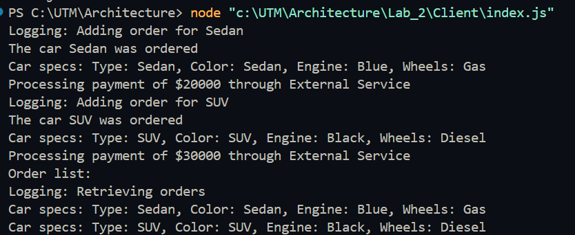

# **Structural Design Patterns**

## **Author:** Maxim Comarov

---

## **Objectives:**

* Study and understand Structural Design Patterns.
* Extend a specific domain with additional functionalities.
* Implement at least 3 Structural Design Patterns within the specific domain to improve modularity, flexibility, and scalability.

---

## **Used Design Patterns:**

* **Facade Pattern** - Simplifies client interactions with complex subsystems by providing a single entry point (`OrderFacade`).
* **Adapter Pattern** - Adapts an incompatible external payment service interface to work within the system (`PaymentProcessor`).
* **Proxy Pattern** - Adds controlled access and logging to the order management system (`OrderManagerProxy`).

---

## **Implementation**

### **Pattern Details**

#### **1. Facade Pattern** - `OrderFacade`

* **Purpose**: `OrderFacade` provides a unified interface for users to place orders and view them, hiding the complexities of order management and payment processing.
* **How It Works**: The user interacts only with `OrderFacade`, which internally coordinates the car creation (via `CarFactory`), order management (via `OrderManagerProxy`), and payment processing (via `PaymentProcessor`).

* **Code Snippet**:

  ```javascript
  const CarFactory = require('../factories/CarFactory');
  const OrderManagerProxy = require('../utilities/OrderManagerProxy');
  const PaymentProcessor = require('../utilities/PaymentProcessor');

  class OrderFacade {
    constructor() {
      this.orderManager = new OrderManagerProxy(); 
      this.paymentProcessor = new PaymentProcessor(); 
    }

    placeOrder(carType, amount) {
      const car = CarFactory.createCar(carType);
      this.orderManager.addOrder(car);
      this.paymentProcessor.pay(amount);
      car.displaySpecs();
    }

    viewOrders() {
      return this.orderManager.getOrders();
    }
  }

  module.exports = OrderFacade;
  ```

---

#### **2. Adapter Pattern** - `PaymentProcessor`

* **Purpose**: `PaymentProcessor` adapts the interface of an external payment service, `ExternalPaymentService`, making it compatible with the system’s payment requirements.
* **How It Works**: The `PaymentProcessor` class provides a `pay` method that internally calls the `processPayment` method of `ExternalPaymentService`, allowing for seamless payment integration.

* **Code Snippet**:

  ```javascript
  const ExternalPaymentService = require('./ExternalPaymentService');

  class PaymentProcessor {
    constructor() {
      this.externalService = new ExternalPaymentService();
    }

    pay(amount) {
      this.externalService.processPayment(amount);
    }
  }

  module.exports = PaymentProcessor;
  ```


---

#### **3. Proxy Pattern** - `OrderManagerProxy`

* **Purpose**: `OrderManagerProxy` controls and logs access to the `OrderManager`, enabling monitoring and potential access restrictions.
* **How It Works**: The proxy class wraps `OrderManager`, logging actions whenever orders are added or retrieved.

* **Code Snippet**:

  ```javascript
  const OrderManager = require('./OrderManager');

  class OrderManagerProxy {
    constructor() {
      this.orderManager = new OrderManager(); 
    }

    addOrder(car) {
      console.log(`Logging: Adding order for ${car.type}`);
      this.orderManager.addOrder(car);
    }

    getOrders() {
      console.log('Logging: Retrieving orders');
      return this.orderManager.getOrders();
    }
  }

  module.exports = OrderManagerProxy;
  ```


---

## **Conclusions / Screenshots / Results**

* **Summary of Benefits**:
  - The **Facade Pattern** reduces client-side complexity, centralizing system interactions within a single class (`OrderFacade`).
  - The **Adapter Pattern** allows smooth integration with external services, like `ExternalPaymentService`, enabling flexible payment processing.
  - The **Proxy Pattern** adds a layer of control and logging, enhancing security and tracking for order management.

* **Screenshot**:



---
