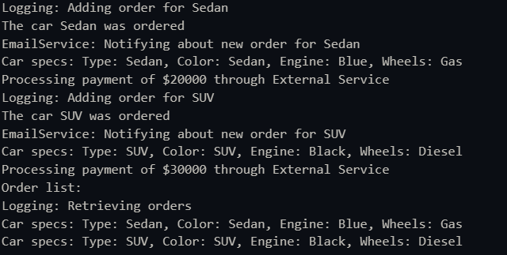

# **Structural Design Patterns**

## **Author:** Maxim Comarov

---

## **Objectives:**

* Study and understand the Behavioral Design Patterns.
* As a continuation of the previous laboratory work, think about what communication between software entities might be involed in your system.
*  Implement some additional functionalities using behavioral design patterns.

---

## **Used Design Patterns:**

* **Observer (EmailService)** - Notifies about order after each creation.


---

## **Implementation**

### **Pattern Details**

#### **1. Observer pattern** - `Observer`

* **Purpose**: `Observer.js` In this code Observer it is used for notifying the observer  (EmailService) after each car is ordred and the EmailService itself sends the notifications.
* **How It Works**: After the order was created in OrderFacade it is triggered a email notification about the order by notifying it about object creation.

* **Code Snippet**:

  ```javascript
  class Observer {
    update(order) {
      throw new Error("This method should be overridden");
    }
  }
  
  module.exports = Observer;
  ```
  ```javascript
  class ExternalPaymentService {
    processPayment(amount) {
      console.log(`Processing payment of $${amount} through External Service`);
    }
  }
  
  module.exports = ExternalPaymentService;
  ```
  ```javascript 
    const CarFactory = require('../Factory/CarFactory');
    const OrderManagerProxy = require('../Models/OrderManagerProxy');
    const PaymentProcessor = require('../../Utilities/PaymentProcessor');
    const EmailService = require('../../Utilities/EmailService');

    class OrderFacade {
    constructor() {
        this.orderManager = new OrderManagerProxy();
        this.paymentProcessor = new PaymentProcessor();
        this.emailService = new EmailService();

        this.orderManager.registerObserver(this.emailService);
    }

    placeOrder(carType, amount) {
        const car = CarFactory.createCar(carType);
        this.orderManager.addOrder(car);
        car.displaySpecs();
        this.paymentProcessor.pay(amount);
    }

    viewOrders() {
        return this.orderManager.getOrders();
    }
    }

    module.exports = OrderFacade;
  ```

---


---

## **Conclusions / Screenshots / Results**

* **Summary of Benefits**:
  - The **Observer Pattern** it is used for notification of each order (`Observer`).


* **Screenshot**:



---
